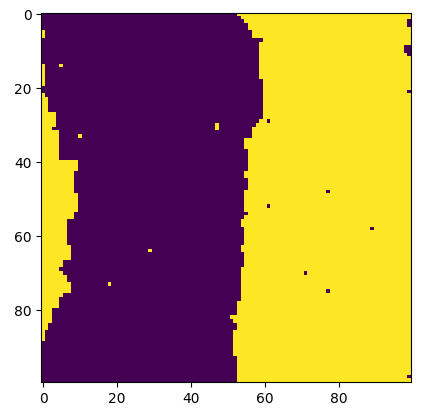

# Ising model simulation in C++

### Uses Glauber dynamics to simulate spins in a magnetic material.

To visualise the animation, run `python plotter.py` which will open a window which plots whatever is in `output.dat`. Then compile and run `ising_model.cpp` with command line arguments `grid size` and `kT` which govern the length of each side of the square grid and the temperature respectively.

Example of the system at a nearly steady state with a single vertical stripe of up spins and down spins.

`other_plotting_methods/` contains scripts to visualise the output using gnuplot and SFML which did not work as well as matplotlib.